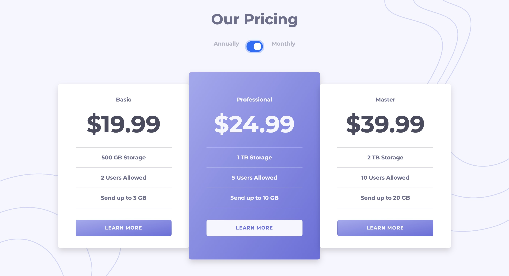

# Frontend Mentor - Pricing component with toggle solution

## Table of contents

- [Overview](#overview)
  - [The challenge](#the-challenge)
  - [Screenshot](#screenshot)
  - [Links](#links)
- [My process](#my-process)
  - [Built with](#built-with)
  - [What I learned](#what-i-learned)
- [Author](#author)

## Overview

### The challenge

Users should be able to:

- View the optimal layout for the component depending on their device's screen size
- Control the toggle with both their mouse/trackpad and their keyboard
- **Bonus**: Complete the challenge with just HTML and CSS

### Screenshot

### Links

- Solution URL: [Add solution URL here](https://your-solution-url.com)
- Live Site URL: [GitHub Pages](https://shiguita.github.io/FM-PricingComponent/)

## My process

### Built with

- Semantic HTML5 markup
- CSS custom properties
- Bootstrap V5 (https://getbootstrap.com/)

### What I learned

For this project I wanted to try out Bootstrap for the first time and got to see it's strengths and advantages. While there's a lot more for me to learn about bootstrap it was a great experience and I hope to develop better skills and grow my understanding of CSS with these excersises.

During development I used a lot of custom CSS and later tried to achieve the same result in bootstrap, there were some things I couldn't get to do but I hope to gain the knowledge neccesary to deal with those types of problems in the future.

### Continued development

## Author

- Frontend Mentor - [@shiguita](https://www.frontendmentor.io/profile/shiguita)
